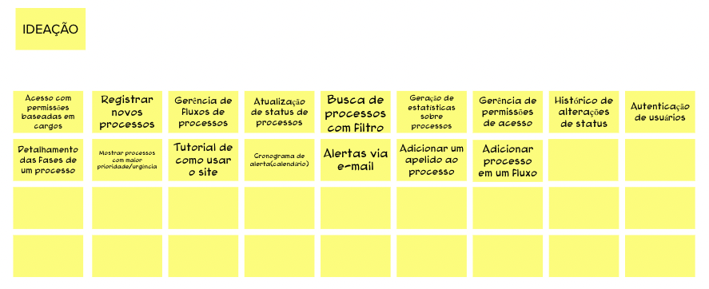
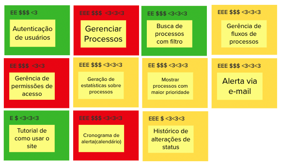

# Lean Inception

## 1. O que é Lean Inception

É um método utilizado por metodologias ágeis para compreender e direcionar o projeto em seu estágio inicial. Ele auxilia no entedimento das principais funcinalidades que os clientes estimam para o produto, e ao seu final é criado o canvas MVP (Produto Mínimo Viável).

## 2. Kick-off

O kick-off é a primeira atividade do Lean Inception, será idetificado quem participará de cada etapa do lean inception e quem irá participar apenas do kick-off e do showcase, é feito então a abertura das atividades por meio de um discurso sobre a iniciativa, além de ser apresentado a agenda da lean inception.

## 3. Visão do Produto

Essa é a primeira etapa para se entender o produto e como ele agrega valor ao negócio dos clientes. Nela são identificados importantes questões relacionadas ao produto, como exemplo, o prolema a ser solucionado, a categoria do produto, os usuários do produto, seu diferencial, entre outros. No nosso projeto foi realizado uma visão de produto para cada persona.

## 4. O produto É - NÃO É - FAZ - NÂO FAZ

O principal obejtivo dessa etapa, além de contribuir para o entedimento do produto é identificar os aspectos positivos e negativos do produto. Para essa atividade os contribuintes separaram em quatro quadrantes oque entediam que o produto era, não era, fazia e não fazia. Assim, por meio desses quadrantes o grupo tem maior entendimento da categoria do produto e oque de fato espera-se que ele seja capaz de fazer.

## 5. Objetivos do Produto

A ideia dessa atividade é tentar resumir o produto em três objetivos julgados realmente importantes, de forma a auxiliar no levantamento e esclarimento desse escopo. Para isso, cada integrante teve de compartilhar sua visão de objetivos do negócio. Ao final, chegou-se a um consenso.

## 6. Personas

A execução dessa etapa consistiu na divisão do time em três grupos a fim de expor possíveis usuários do negócio. Esse processo cria personagens que auxiliarão o time a descrever funcionalidades de acordo com quem vai interagir com o produto final, apresentando não só o papel, mas também as características e necessidades do utente.

|                                                                 |                                                               |
| :-------------------------------------------------------------: | :-----------------------------------------------------------: |
|                             Aristeu                             |                            Cleber                             |
|  |  |
|                             Juninho                             |                            Wagner                             |
|  |  |

## 7. Jornada do Usuário

Juntamente com o exercício de personas, esta atividade procura traçar, de forma sequencial, a jornada dos usuários criados até alcançar um objetivo. O intuito é alegar os diferentes pontos de contato e a interação dos envolvidos com o produto.

|                                                                 |                                                               |
| :-------------------------------------------------------------: | :-----------------------------------------------------------: |
|                             Aristeu                             |                            Cleber                             |
|  |  |
|                             Juninho                             |                            Wagner                             |
|  |  |

## 8. Brainstorming de Funcionalidades

Nesta fase chega-se às funcionalidades. Ela determinada as ações e interações funcionais que o usuário terá com o produto de acordo com suas necessidades e objetivos de negócio que agregarão valor. A atividade foi realizada em conjunto, descrevendo-se de forma simples e concisa as possíveis aplicações e, ao final, chegando-se a um consenso.

## 9. Revisão Técnica, de Negócio e de UX

Nesta revisão, foi esboçado o conhecimento técnico do time para cada funcionalidade de acordo com o que fazer e como fazer, sendo vermelho para baixo, amarelo para médio e verde para alto entendimento. Além disso, foi descrito, em uma escala de 1 a 3, como o time julgava cada aplicação em níveis de esforço (E), negócio ($) e UX (<3). Essa fase ajuda na compreensão da complexidade e importância das funcionalidades, consequentemente, da priorização, estimação e planejamento.

## 10. Sequenciador

O Sequenciador serve para deixar as funcionalidades de forma sequencial ao desenvolvimento, informando quais aplicações serão implementadas no MVP (Mínimo Produto Viável) e o que será incremento. A etapa auxilia na visualização e organização da validação das ideias. É importante ressaltar que a atividade é discorrida a partir de regras estabelecidas pela Lean Inception.

## 11. Canvas MVP

Esta é a etapa final da Lean Inception. Trata-se de um quadro que resume as discuções e definições das fases anteriores a fim de apresentar um MVP que possa ser validado e utilizado pelo usuário. Este processo ajuda a definir estratégias de desenvolvimento e traz como critérios a proposta do MVP, personas segmentadas, jornadas, funcionalidades, resultado esperado, métricas para validar as hipóteses do negócio e custo e cronograma.

